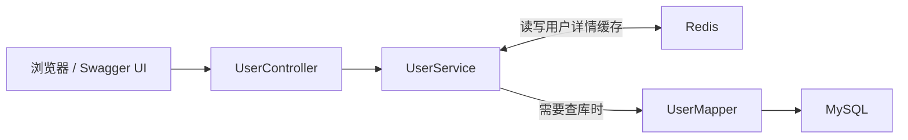

# Java Backend Practice

面向 Java 后端实习与校招的个人学习仓库，包含 Java 基础、数据结构与算法练习，以及一个基于 Spring Boot、MyBatis、MySQL 和 Redis 的用户中心学习项目。

## 项目介绍

用户中心目前支持：

- 新增用户、查询启用状态的用户、启用或禁用账号。
- 用户名查重、BCrypt 密码哈希和登录校验；接口返回的用户信息不包含密码。
- 用户登录、退出登录，以及通过 HttpSession 查询当前登录用户。
- 使用 Redis 缓存用户详情，正常缓存有效期 10 分钟；查无用户时保存 2 分钟的字符串 `NULL` 标记，减少重复回源查询。
- 修改用户状态后删除对应缓存；缓存 JSON 格式错误时删除缓存并重新查询 MySQL。
- 使用 Swagger UI 查看和调用接口，通过 SLF4J 记录运行与异常日志。
- 提供 Redisson 锁竞争的学习演示。

这是持续完善的学习项目，当前功能边界见文末“待改进项”。

## 技术栈

| 技术 | 在项目中的作用 |
|---|---|
| Java 17 | 编写和运行后端代码 |
| Spring Boot | 搭建后端应用，提供 HTTP 接口；当前版本为 4.1.0 |
| MyBatis | 执行 SQL，将查询结果映射为 Java 对象 |
| MySQL 8 | 保存用户等业务数据 |
| Redis 8 | 缓存用户详情和不存在用户的空值标记 |
| Redisson | 实现 Redis 锁竞争的学习演示 |
| springdoc / Swagger UI | 生成接口文档，查看和调用接口 |
| SLF4J | 提供统一的日志记录接口 |
| Lombok | 通过注解生成常用方法和日志对象 |
| JUnit / Mockito | 编写隔离测试，模拟数据库、Redis 和锁等依赖 |

开发工具：IntelliJ IDEA。用户中心通过 Maven 构建，仓库内提供 Maven Wrapper。

## 仓库目录

```text
java-backend-practice/
├── src/
│   ├── day01/、day2/ ... day17/  # Java 基础、集合、泛型、文件、Lambda、Stream
│   ├── day18/                  # 栈与队列
│   ├── day19/                  # 链表
│   ├── day20/                  # 冒泡排序、选择排序
│   ├── day21/                  # 二叉树节点与前序遍历
│   └── hot100/                 # 两数之和、有效括号、二分查找等算法练习
├── sql/                        # MySQL 建库建表、查询与聚合练习
├── docs/                       # 项目介绍和学习笔记
├── springboot-user-center/
│   └── springboot-user-center/ # 用户中心 Maven 模块（实际有两层同名目录）
│       ├── pom.xml
│       ├── mvnw.cmd
│       ├── api-test.http
│       └── src/
│           ├── main/java/com/ming/usercenter/
│           ├── main/resources/application.properties
│           └── test/java/com/ming/usercenter/
└── README.md
```

## 项目分层

| 层次 | 对应代码 | 主要职责 |
|---|---|---|
| Controller | UserController | 接收 HTTP 请求，调用业务方法，返回结果 |
| Service | UserService | 处理业务规则、缓存和返回数据的转换 |
| Mapper | UserMapper | 通过 MyBatis 执行 SQL，访问 MySQL |



查询用户列表 `GET /users` 的过程：

```text
浏览器 / Swagger UI → UserController → UserService → UserMapper → MySQL
结果返回：MySQL → UserMapper → UserService 整理用户信息 → Controller 返回 JSON
```

查询单个用户 `GET /users/{id}` 时，Service 先读取 Redis：有效缓存命中则直接返回，空值标记命中则返回用户不存在；没有可用缓存时才调用 Mapper 查询 MySQL，再按结果写入缓存。

`entity/User` 对应数据库用户记录，`dto/UserResponse` 只返回 id、username、age。统一响应格式由 `common/ApiResponse` 提供，异常由 `exception/GlobalExceptionHandler` 处理。

## 运行普通 Java 练习

1. 使用 IntelliJ IDEA 打开仓库根目录，将项目 SDK 配置为 JDK 17。
2. 找到根目录 `src` 中带有 `main` 方法的练习类，例如 `day20/BubbleSortDemo.java`。
3. 运行该类的 `main` 方法，在 Run 窗口查看输出。

这些练习与下面的 Spring Boot 模块分别运行。

## 运行用户中心（Windows 本地）

### 1. 准备环境

- 安装 JDK 17；IDEA 的项目 SDK 和 Maven 运行 JDK 均使用 17。命令行运行时需正确配置 `JAVA_HOME`。
- 安装并启动 MySQL 8，准备有建库、建表和创建账号权限的本地管理员账号。
- 启动 Redis；下面提供 Docker Desktop 的运行方法。
- 首次使用 Maven Wrapper 需要联网下载 Maven 和依赖。也可以使用自己已配置好的 Maven 执行相同目标。

当前配置见 [application.properties](springboot-user-center/springboot-user-center/src/main/resources/application.properties)：

| 配置项 | 默认值 |
|---|---|
| 应用地址 | `http://localhost:8080` |
| MySQL 地址 | `localhost:3306` |
| 数据库 | `java_backend_practice` |
| 数据库账号 | `java_app` |
| 数据库密码 | 环境变量 `DB_PASSWORD` |
| Redis 地址 | `127.0.0.1:6379` |
| Redis 数据库编号 | `0` |

下面的 Redis 示例用于本机、无密码连接，与当前 RedisTemplate 和 Redisson 配置一致。

### 2. 初始化 MySQL（首次运行）

在 Windows“服务”中启动实际安装的 MySQL 服务；本项目开发机的服务名为 `MySQL80`。已经初始化过数据库和账号时可以跳过本节。

在数据库客户端打开 [mysql_day01_basics.sql](sql/mysql_day01_basics.sql)，执行第 1、2 节的建库、建表语句。

也可以在**仓库根目录**打开 PowerShell，启动 MySQL 命令行客户端：

```powershell
mysql --default-character-set=utf8mb4 -u root -p
```

输入本机 MySQL 管理员密码后，在 `mysql>` 提示符下执行：

```sql
source sql/mysql_day01_basics.sql;
```

当前脚本启用的是建库建表和查询，示例新增、更新、删除语句均已注释。`source` 是 MySQL 客户端命令，具体用法见 [MySQL 官方说明](https://dev.mysql.com/doc/refman/8.4/en/mysql-batch-commands.html)。若 PowerShell 找不到 `mysql`，可使用 MySQL 安装目录中的 `bin/mysql.exe`，或直接使用图形化数据库客户端执行 SQL。

接着由管理员创建应用账号。**执行前将占位密码替换为自己设置的本地数据库密码**：

```sql
CREATE USER IF NOT EXISTS 'java_app'@'localhost'
    IDENTIFIED BY 'REPLACE_WITH_YOUR_LOCAL_DB_PASSWORD';

GRANT SELECT, INSERT, UPDATE
    ON java_backend_practice.* TO 'java_app'@'localhost';
```

如果 `java_app` 已存在，`CREATE USER IF NOT EXISTS` 不会修改原密码，后续 `DB_PASSWORD` 应填写该账号的现有密码。它与 MySQL 管理员密码、用户中心的登录密码是不同用途的密码。

建表脚本里的 `hashed_password_1` 等内容是 SQL 教学占位值，不能当作可登录密码；需要测试登录时，应通过用户中心新增接口创建账号。

### 3. 启动 Redis

先打开 Docker Desktop。如果已存在名为 `redis-learning` 的容器，可以在 Containers 页面点击启动，也可以执行：

```powershell
docker start redis-learning
docker exec redis-learning redis-cli PING
```

返回 `PONG` 表示 Redis 能响应。当前学习使用该容器映射的本机 6379 端口。

全新环境没有这个容器时，执行一次以下命令创建它（已有容器时不要重复创建）：

```powershell
docker run -d --name redis-learning -p 127.0.0.1:6379:6379 --mount type=volume,source=redis-learning-data,target=/data redis:8-alpine redis-server --appendonly yes
docker exec redis-learning redis-cli PING
```

该命令将端口绑定到本机回环地址，并将 Redis 数据目录放在命名卷中；参数说明见 [Docker 官方文档](https://docs.docker.com/reference/cli/docker/container/run/)。如果本机 6379 已有其他 Redis 服务，确认它满足上面的连接配置后可直接使用。

### 4. 在 IDEA 启动 Spring Boot

1. 打开 `springboot-user-center/springboot-user-center/pom.xml`，将其作为 Maven 项目导入并加载依赖。
2. 在 `SpringbootUserCenterApplication` 的运行配置中，设置环境变量 `DB_PASSWORD`，值为上一步 `java_app` 的实际密码。沿用已有可运行配置时，保留其中正确的密码设置。
3. 确认 MySQL、Redis 已启动，且 8080 端口没有被旧的应用实例占用。
4. 运行 `com.ming.usercenter.SpringbootUserCenterApplication` 的 `main` 方法。
5. Run 窗口出现 `Started SpringbootUserCenterApplication` 后，按下一节检查接口。

密码通过运行配置或环境变量提供，不需要写进仓库的 `application.properties`。

如果希望通过命令行启动，在**仓库根目录**的 PowerShell 执行：

```powershell
Set-Location .\springboot-user-center\springboot-user-center
$dbPassword = Read-Host '输入 java_app 的 MySQL 密码' -AsSecureString
$env:DB_PASSWORD = [System.Net.NetworkCredential]::new('', $dbPassword).Password
.\mvnw.cmd spring-boot:run
```

该环境变量只设置在当前 PowerShell 进程及其子进程中，不会自动传给已经打开的 IDEA。已有可用 Maven 时，也可以在同一模块目录执行 `mvn spring-boot:run`；参见 [Spring Boot Maven 启动说明](https://docs.spring.io/spring-boot/maven-plugin/run.html)。

### 5. 检查启动结果

打开 [Swagger UI](http://localhost:8080/swagger-ui/index.html)，展开 `GET /users`，依次点击 **Try it out → Execute**。

- 查看实际的 `Server response` 和 `Response body`；页面原有的 `Example Value` 只是示例。
- 本项目成功响应的业务 `code` 为 `200`，`message` 为 `success`。刚建好的空数据库返回 `data: []` 是正常结果。
- 可通过 `POST /users` 创建一个测试用户，再使用返回的 id 查询 `GET /users/{id}`；用户名应为 3～50 个字符、密码为 6～50 个字符、年龄为 1～150。
- 测试登录时，使用刚创建的账号调用 `POST /users/login`，在同一个浏览器会话中调用 `GET /users/me`，最后调用 `POST /users/logout`。

接口 JSON 定义入口为 [OpenAPI 文档](http://localhost:8080/v3/api-docs)。HTTP 状态与响应体中的业务 `code` 应分别检查，当前异常响应的已知问题见“待改进项”。

## 核心接口

本地Docker运行用户中心的步骤和端口、环境变量说明见 [9月7日Docker学习笔记](docs/study-notes-2026-09-07.md)。这是单个应用容器连接现有MySQL/Redis的学习方式，并非完整Compose部署或生产配置。

| 方法 | 路径 | 用途 |
|---|---|---|
| GET | `/users` | 查询启用状态的用户列表 |
| POST | `/users` | 新增用户 |
| GET | `/users/{id}` | 查询启用状态的单个用户，使用 Redis 缓存 |
| PATCH | `/users/{id}/status?status=0或1` | 禁用或启用用户，更新后删除详情缓存 |
| POST | `/users/login` | 校验账号密码，建立 Session 登录态 |
| GET | `/users/me` | 查询当前 Session 中的登录用户 |
| POST | `/users/logout` | 退出登录，销毁 Session |
| GET | `/redis-lock/test?requestId=A` | 锁竞争学习演示，会模拟约 10 秒处理过程 |

`api-test.http` 保留了学习过程中的请求示例；其中的固定用户 id 和状态修改请求应按自己的测试数据调整后再执行。

## 测试与验证

在用户中心 Maven 模块目录中执行隔离测试：

```powershell
.\mvnw.cmd -Dtest=LoggingCleanupTest test
```

`LoggingCleanupTest` 使用模拟的 MySQL Mapper、Redis 和锁，覆盖缓存命中、空值缓存、损坏 JSON 回源、序列化异常日志、状态更新清理缓存、兜底错误日志、未持锁不解锁、中断清理和 SQL 日志配置等，共 11 项；2026-09-04 已执行并全部通过。运行这些隔离测试不需要真实 MySQL 或 Redis。

执行 `.\mvnw.cmd test` 会同时运行 `@SpringBootTest` 的上下文测试，需要按前面的步骤准备环境、启动 Redis 并设置数据库连接信息。应用上下文启动成功和隔离测试通过，都不能替代完整的接口及安全测试。

## 待改进项

- 完善 HTTP 异常状态映射：当前部分错误响应仍为 HTTP 200，但业务 `code` 为 400、401、403、404 或 500；部分参数和资源错误被兜底处理成业务 500。
- 为修改用户状态等敏感接口增加登录和角色权限校验；当前状态修改接口尚未限制管理员访问。
- 明确禁用账号后的旧 Session 处理策略；当前禁用会阻止新的登录，但已经建立的 Session 不会立即撤销。
- 完善部署、集成测试和日志管理。目前没有完整的角色权限、分页接口或实际业务场景的分布式锁保障；锁接口用于学习演示。

## 后续学习目标

项目介绍及二叉树入门示例说明见 [9 月 5 日学习笔记](docs/study-notes-2026-09-05.md)。

- 巩固 Java 基础、集合、数据结构与算法，能解释并独立修改练习代码。
- 在现有 Spring Boot、MyBatis、MySQL 和 Redis 功能基础上，继续完善异常处理、权限、测试和部署。
- 整理项目演示材料，练习说明功能流程、技术选择和已知边界。

仓库记录学习与实验过程，随实际实现和验证结果持续更新。
